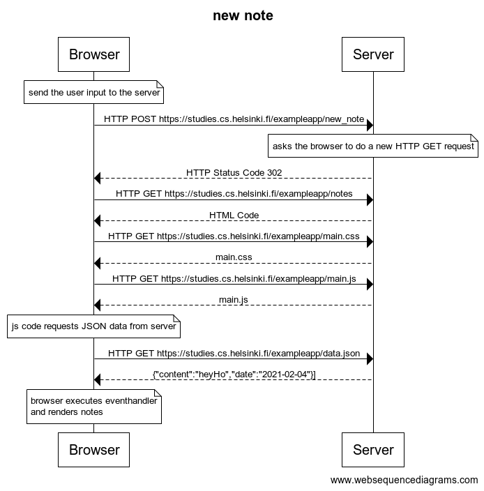
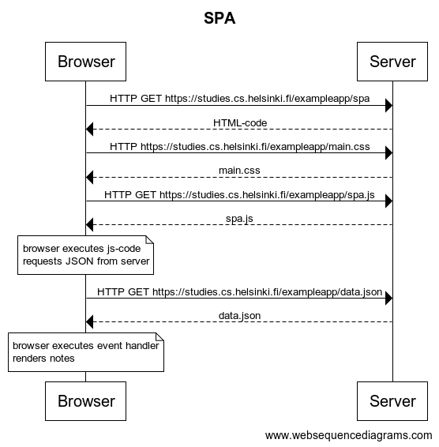
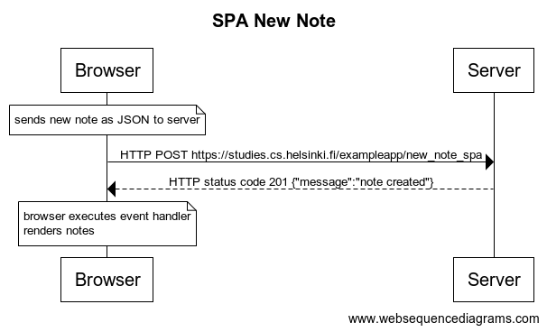

# FullStackOpen PART 0

## [Fundamentals of Web apps](https://fullstackopen.com/en/part0/fundamentals_of_web_apps)

### 0.1 HTML

Review the basics of HTML by reading this tutorial from Mozilla: [HTML tutorial](https://developer.mozilla.org/en-US/docs/Learn/Getting_started_with_the_web/HTML_basics)

### 0.2 CSS

Review the basics of CSS by reading this tutorial from Mozilla: [CSS tutorial](https://developer.mozilla.org/en-US/docs/Learn/Getting_started_with_the_web/CSS_basics)

### 0.3 HTML forms

Learn about the basics of HTML forms by reading Mozilla's tutorial: [Your first form](https://developer.mozilla.org/en-US/docs/Learn/Forms/Your_first_form)

## 0.4 new note

Create a diagram depicting the situation where the user creates a new note on page <https://fullstack-exampleapp.herokuapp.com/notes> by writing something into the text field and clicking the submit button.



```

title newnote 

note over  Browser
send the user input to the server
end note

Browser->Server: HTTP POST https://studies.cs.helsinki.fi/exampleapp/new_note

note over Server
asks the browser to do a new HTTP GET request
end note

Server-->Browser: HTTP Status Code 302
Browser->Server: HTTP GET https://studies.cs.helsinki.fi/exampleapp/notes
Server-->Browser: HTML Code
Browser->Server: HTTP GET https://studies.cs.helsinki.fi/exampleapp/main.css
Server-->Browser: main.css
Browser->Server: HTTP GET https://studies.cs.helsinki.fi/exampleapp/main.js
Server-->Browser: main.js

note over Browser
js code requests JSON data from server
end note 

Browser->Server: HTTP GET https://studies.cs.helsinki.fi/exampleapp/data.json
Server-->Browser: {"content":"heyHo","date":"2021-02-04"}]

note over Browser
browser executes eventhandler 
and renders notes
end note

```


### 0.5 Single page app

Create a diagram depicting the situation where the user goes to the single page app version of the notes app at <https://fullstack-exampleapp.herokuapp.com/spa>.



```
title spa


Browser->Server: HTTP GET https://studies.cs.helsinki.fi/exampleapp/spa
Server-->Browser: HTML-code
Browser->Server: HTTP https://studies.cs.helsinki.fi/exampleapp/main.css
Server-->Browser: main.css
Browser->Server: HTTP GET https://studies.cs.helsinki.fi/exampleapp/spa.js
Server-->Browser: spa.js

note over Browser
browser executes js-code 
requests JSON from server
end note

Browser->Server: HTTP GET https://studies.cs.helsinki.fi/exampleapp/data.json
Server-->Browser: data.json
note over Browser
browser executes event handler
renders notes
end note
```

### 0.6 New note on Single page app

Create a diagram depicting the situation where user creates a new note using the single page version of the app.



```

title spanewnote 

note over Browser
sends new note as JSON to server
end note 
Browser->Server: HTTP POST https://studies.cs.helsinki.fi/exampleapp/new_note_spa
Server-->Browser:HTTP status code 201 {"message":"note created"}

note over Browser
browser executes event handler
renders notes 
end note 

```
# FullStackOpen
# FullStackOpen
